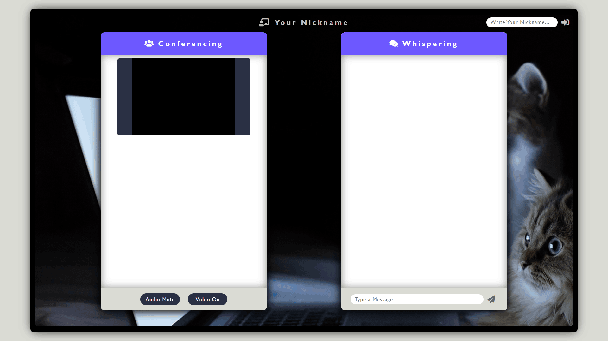
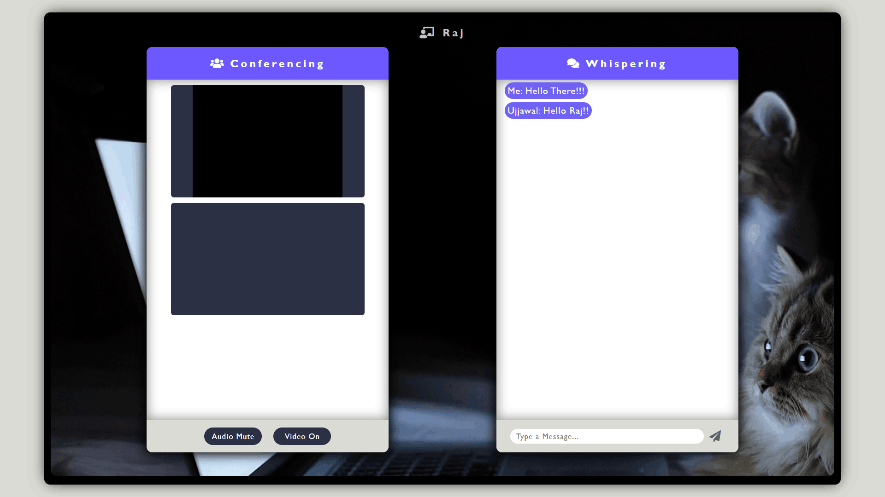

<p  align="right">
# Video Chat Web Application
# Hi, I'm Raj! 👋
## 🔗 Links
[](https://www.linkedin.com/in/ayerajkumar/)

This Project is a video chat web application made for making group videos and text chat with our friends.


To RUN this project, Your system must have Python3 installed.

## Screenshots



## Download Python & Install it

Visit Python Official Website or Click here [Python3.10.1](https://www.python.org/ftp/python/3.10.1/python-3.10.1-amd64.exe) to Download.
    
## Run Locally

1. Download this project

    or

    You can clone it to your Github Account by executing the code below in your system terminal. (Ignore this step, If you have already downloaded)
```bash
  git clone https://github.com/AyeRaj/VideoChatWebApp.git
```

2. Go to the project directory & open terminal

    Then, run the code given below to Install DJANGO framework in your system.

```bash
  python -m pip install django
```

3. Then, Install CHANNELS module

```bash
  python -m pip install channels
```
- Or You can directly install all the dependencies by
> ignore this step if step 2 & 3 have been done.
```bash
  pip install -r requirements.txt
```

4. Run the Code in Terminal of Parent directory to Start the server

```bash
  python manage.py runserver
```
5. Then, click of Local Host Server link to open the project in browser


💬 Ask me, If your project is not running - 
[Linkedin](https://www.linkedin.com/in/ayerajkumar)
## 🚀 About Me
I'm an Engineering Student & A Full Stack Web Developer


## 🛠 Skills Required to Build Project...
Javascript, HTML, CSS, REACT, Python, Django...

## Documentation
- [Python](https://docs.python.org/3.10/#)
- [Django](https://docs.djangoproject.com/en/4.0/)
- [Channels](https://channels.readthedocs.io/en/stable/)

## Feedback

If you have any feedback, please reach out to us at ayerajkumar@gmail.com

